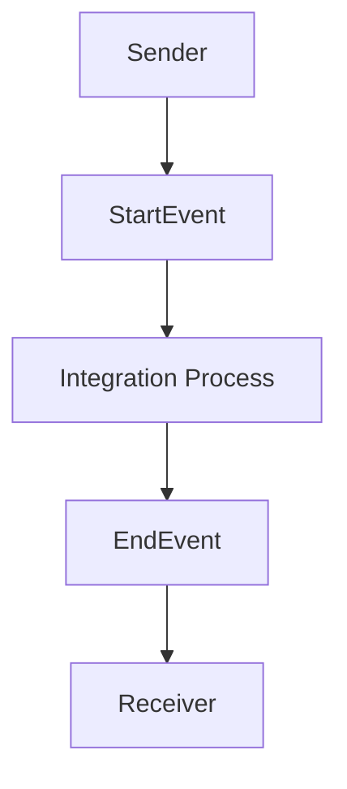

PAGE 1:

iflow1

| Author | Date | Version |
| --- | --- | --- |
| Your Name | Today's Date | 1.0 |

PAGE 2:
1. **Architecture**: The iflow1 integration flow is designed using SAP Cloud Platform Integration (CPI). It consists of a sender, receiver, and an integration process.

2. **Purpose**: The purpose of this integration flow is to demonstrate a basic integration scenario between a sender and receiver system, with an integration process in between.

3. **Sender / Receiver systems**: 
   - **Sender**: EndpointSender
   - **Receiver**: EndpointRecevier

4. **Adapter types used**: 
   - The adapter types used in this integration flow are not explicitly specified in the provided XML code. However, based on the participant types, it can be inferred that HTTP or other standard adapters might be used.

5. **Step-by-step flow logic**: 
   - The integration flow starts with a **StartEvent**.
   - The sequence flow then proceeds to an **EndEvent**, indicating the completion of the integration process.

6. **Mapping logic summary**: 
   - No explicit mapping logic is provided in the given XML code. However, in a real-world scenario, mapping would be used to transform the sender's data into the required format for the receiver.

7. **Groovy script explanation**: 
   - No Groovy script is provided in the given XML code. However, Groovy scripts can be used in SAP CPI to perform custom logic, data transformations, or to interact with external systems.

8. **Error handling**: 
   - Error handling is not explicitly specified in the provided XML code. However, in a real-world scenario, error handling mechanisms such as exception subprocesses or error endpoints would be used to handle any errors that occur during the integration process.

9. **Security / Authentication**: 
   - The provided XML code specifies that basic authentication is not enabled for the sender.
   - Other security mechanisms such as OAuth, API keys, or SSL/TLS might be used to secure the integration flow, but they are not explicitly specified in the given code.

10. **High-Level Mermaid Diagram**:

