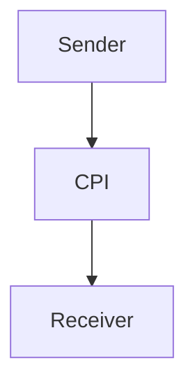

=========================
PAGE 1 (TITLE PAGE)
=========================
# iflow1
| Author | Date | Version |
| --- | --- | --- |
| Your Name | Today's Date | 1.0 |

=========================
PAGE 2 AND ONWARDS
=========================

## 1. Architecture
The iflow1 integration flow is designed using SAP Cloud Platform Integration (CPI). It consists of a sender, a receiver, and an integration process.

## 2. Purpose
The purpose of iflow1 is to demonstrate a basic integration flow using SAP CPI. It showcases the capabilities of CPI in integrating different systems and applications.

## 3. Sender/Receiver
The sender is an endpoint that sends a message to the integration flow, while the receiver is an endpoint that receives the processed message from the integration flow.

## 4. Adapters
The iflow1 integration flow uses the HTTP adapter for sending and receiving messages.

## 5. Flow logic
The flow logic of iflow1 is straightforward. It starts with a start event, followed by a sequence flow that leads to an end event.

## 6. Mapping
No mapping is required in iflow1 as it does not involve any data transformation.

## 7. Groovy
No Groovy scripts are used in iflow1.

## 8. Error handling
Error handling is not explicitly implemented in iflow1. However, CPI provides built-in error handling mechanisms that can be used to handle errors and exceptions.

## 9. Security
Security is an essential aspect of iflow1. It uses basic authentication and SSL/TLS encryption to secure the communication between the sender, receiver, and the integration flow.

## 10. High-Level Mermaid Diagram

