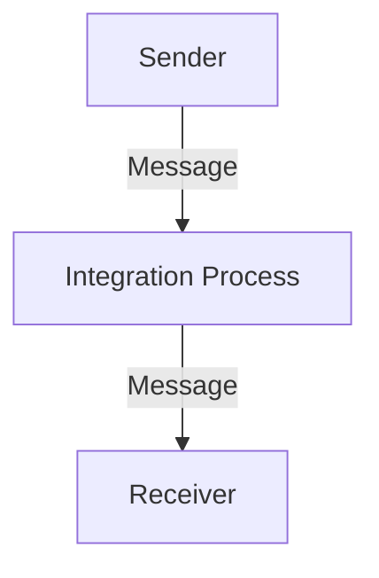

<h1 style="color: #1f4e79; text-align: center; font-size: 3.5em; margin-bottom: 10px;">iflow1</h1><h2 style="text-align: center; font-size: 1.8em; font-weight: normal; margin-top: 0;">Technical Specification Document</h2>

<table style="width: 60%; margin: 0 auto;"><tr><th>Author</th><td>Akila710</td></tr><tr><th>Date</th><td>2026-01-06</td></tr><tr><th>Version</th><td>1.0.0</td></tr></table>

<h1 style="color: #1f4e79; font-size: 2.5em;">Table of Contents</h1>
1. Introduction  
&nbsp;&nbsp;&nbsp; 1.1 Purpose  
&nbsp;&nbsp;&nbsp; 1.2 Scope  
2. Integration Overview  
&nbsp;&nbsp;&nbsp; 2.1 Integration Architecture  
&nbsp;&nbsp;&nbsp; 2.2 Integration Components  
3. Integration Scenarios  
&nbsp;&nbsp;&nbsp; 3.1 Scenario Description  
&nbsp;&nbsp;&nbsp; 3.2 Data Flows  
&nbsp;&nbsp;&nbsp; 3.3 Security Requirements  
4. Error Handling and Logging  
5. Testing Validation  
6. Reference Documents  

<h1 style="color: #1f4e79;">1. Introduction</h1>
<b style="color: #1f4e79;">1.1 Purpose:</b>  
The iFlow 'iflow1' addresses the need for seamless data transfer between a sender and a receiver system. The trigger mechanism for this iFlow is a message start event, which initiates the integration process. The technical outcome is the successful transmission of messages from the sender to the receiver, ensuring data integrity and consistency throughout the process. The artifacts involved include the BPMN definitions that outline the integration flow, including start and end events, and the sequence flow that connects them.

<b style="color: #1f4e79;">1.2 Scope:</b>  
The scope of 'iflow1' includes the following endpoints:
- **Sender Endpoint:** Initiates the data transfer.
- **Receiver Endpoint:** Receives the data from the sender.

The data transformation logic is minimal in this flow, as it primarily focuses on the direct transfer of messages without complex transformations. The target systems involved are the sender and receiver systems, which are expected to communicate effectively through this integration flow.

<h1 style="color: #1f4e79;">2. Integration Overview</h1>
<b style="color: #1f4e79;">2.1 Integration Architecture:</b>  

<b style="color: #1f4e79;">2.2 Integration Components:</b>  
| Component                | Role                        | Details                                                                 |
|--------------------------|-----------------------------|-------------------------------------------------------------------------|
| EndpointSender           | Initiates the integration   | Represents the sender system that triggers the iFlow.                   |
| EndpointReceiver         | Receives the data           | Represents the receiver system that accepts the data from the sender.    |
| Integration Process      | Manages the flow            | Contains the logic for processing the message from sender to receiver.   |

<h1 style="color: #1f4e79;">3. Integration Scenarios</h1>
<b style="color: #1f4e79;">3.1 Scenario Description:</b>  
1. The integration process starts with the **Start Event** triggered by the sender.
2. The message is sent from the sender to the integration process.
3. The integration process receives the message and prepares it for transmission.
4. The message is then sent to the receiver.
5. The process concludes with the **End Event**, indicating successful completion.

<b style="color: #1f4e79;">3.2 Data Flows:</b>  
The data flow in 'iflow1' is straightforward, with a single message being sent from the sender to the receiver without any transformation or additional processing.

<b style="color: #1f4e79;">3.3 Security Requirements:</b>  
- Basic authentication is not enabled for this flow.
- No sensitive data is being transmitted, thus reducing the need for complex security measures.
- Ensure that the endpoints are secured and monitored for unauthorized access.

<h1 style="color: #1f4e79;">4. Error Handling and Logging</h1>  
Error handling is managed through the logging of all events. Any errors encountered during the integration process will be logged for further analysis, ensuring that issues can be addressed promptly.

<h1 style="color: #1f4e79;">5. Testing Validation</h1>  
**Testing Details – Sheet: Testing**  
| Test Case ID | Scenario                      | Expected Outcome                          |
| :---         | :---                          | :---                                      |
| TC01         | Send message from sender      | Message is successfully received by receiver. |
| TC02         | Trigger integration process    | Integration process completes without errors. |

<h1 style="color: #1f4e79;">6. Reference Documents</h1>  
- SAP CPI Documentation  
- BPMN 2.0 Specification  
- Integration Patterns and Best Practices  
