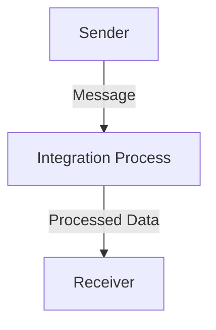

<h1 style="color: #1f4e79; text-align: center; font-size: 3.5em; margin-bottom: 10px;">iflow1</h1><h2 style="text-align: center; font-size: 1.8em; font-weight: normal; margin-top: 0;">Technical Specification Document</h2>

<table style="width: 60%; margin: 0 auto;"><tr><th>Author</th><td>Akila710</td></tr><tr><th>Date</th><td>2026-01-05</td></tr><tr><th>Version</th><td>1.0.0</td></tr></table>

<h1 style="color: #1f4e79; font-size: 2.5em;">Table of Contents</h1>
1. Introduction  
&nbsp;&nbsp;&nbsp; 1.1 Purpose  
&nbsp;&nbsp;&nbsp; 1.2 Scope  
2. Integration Overview  
&nbsp;&nbsp;&nbsp; 2.1 Integration Architecture  
&nbsp;&nbsp;&nbsp; 2.2 Integration Components  
3. Integration Scenarios  
&nbsp;&nbsp;&nbsp; 3.1 Scenario Description  
&nbsp;&nbsp;&nbsp; 3.2 Data Flows  
&nbsp;&nbsp;&nbsp; 3.3 Security Requirements  
4. Error Handling and Logging  
5. Testing Validation  
6. Reference Documents  

<h1 style="color: #1f4e79;">1. Introduction</h1>
<b style="color: #1f4e79;">1.1 Purpose:</b>  
The iFlow 'iflow1' addresses the need for seamless data exchange between systems by providing a reliable integration solution. The trigger mechanism for this iFlow is a message start event, which initiates the process when a message is received. The technical outcome is the successful transmission of data from the sender endpoint to the receiver endpoint, ensuring that the data is processed without errors and logged for auditing purposes.

<b style="color: #1f4e79;">1.2 Scope:</b>  
The iFlow encompasses the following endpoints:
- **Sender Endpoint:** Initiates the integration process.
- **Receiver Endpoint:** Receives the processed data.

The data transformation logic is minimal in this iFlow, as it primarily serves as a pass-through mechanism. The target systems involved are the sender and receiver systems, which are configured to communicate via the defined endpoints.

<h1 style="color: #1f4e79;">2. Integration Overview</h1>
<b style="color: #1f4e79;">2.1 Integration Architecture:</b>  

<b style="color: #1f4e79;">2.2 Integration Components:</b>  
| Component               | Role                       | Details                                                                 |
|------------------------|----------------------------|-------------------------------------------------------------------------|
| EndpointSender         | Initiates the integration   | Receives incoming messages to start the iFlow.                         |
| EndpointReceiver       | Receives the processed data | Accepts the data after processing is complete.                          |
| Integration Process     | Core processing logic       | Manages the flow from start to end, ensuring data is passed correctly. |

<h1 style="color: #1f4e79;">3. Integration Scenarios</h1>
<b style="color: #1f4e79;">3.1 Scenario Description:</b>  
1. The sender system sends a message to the iFlow.
2. The iFlow is triggered by the start event.
3. The integration process executes, passing the message through to the receiver.
4. The receiver system receives the processed data.
5. The iFlow completes and logs the transaction.

<b style="color: #1f4e79;">3.2 Data Flows:</b>  
The data flows from the sender to the integration process and then to the receiver without any transformation, ensuring that the original message is preserved.

<b style="color: #1f4e79;">3.3 Security Requirements:</b>  
- Basic authentication is disabled for the sender endpoint.
- No sensitive data is transmitted, minimizing security risks.

<h1 style="color: #1f4e79;">4. Error Handling and Logging</h1>  
The iFlow is configured to log all events, which aids in troubleshooting and monitoring. Any errors encountered during the integration process will be captured in the logs for further analysis.

<h1 style="color: #1f4e79;">5. Testing Validation</h1>  
**Testing Details – Sheet: Testing**  
| Test Case ID | Scenario                       | Expected Outcome                          |
| :---         | :---                           | :---                                      |
| TC_001       | Send message from sender       | Message is received by the integration process. |
| TC_002       | Process message to receiver     | Receiver successfully receives the processed data. |

<h1 style="color: #1f4e79;">6. Reference Documents</h1>  
- SAP CPI Documentation  
- Integration Patterns Guide  
- Security Best Practices for SAP CPI  
