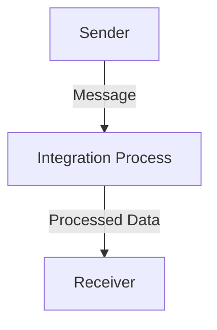

<h1 style="color: #1f4e79; text-align: center; font-size: 3.5em; margin-bottom: 10px;">iflow1</h1><h2 style="text-align: center; font-size: 1.8em; font-weight: normal; margin-top: 0;">Technical Specification Document</h2>

<table style="width: 60%; margin: 0 auto;"><tr><th>Author</th><td>Akila710</td></tr><tr><th>Date</th><td>2026-01-05</td></tr><tr><th>Version</th><td>1.0.0</td></tr></table>

<h1 style="color: #1f4e79; font-size: 2.5em;">Table of Contents</h1>
1. Introduction  
&nbsp;&nbsp;&nbsp; 1.1 Purpose  
&nbsp;&nbsp;&nbsp; 1.2 Scope  
2. Integration Overview  
&nbsp;&nbsp;&nbsp; 2.1 Integration Architecture  
&nbsp;&nbsp;&nbsp; 2.2 Integration Components  
3. Integration Scenarios  
&nbsp;&nbsp;&nbsp; 3.1 Scenario Description  
&nbsp;&nbsp;&nbsp; 3.2 Data Flows  
&nbsp;&nbsp;&nbsp; 3.3 Security Requirements  
4. Error Handling and Logging  
5. Testing Validation  
6. Reference Documents  

<h1 style="color: #1f4e79;">1. Introduction</h1>
<b style="color: #1f4e79;">1.1 Purpose:</b>  
The iFlow 'iflow1' addresses the need for seamless data exchange between systems by providing a structured integration process. The trigger mechanism for this iFlow is a message start event, which initiates the integration process upon receiving a message. The technical outcome is the successful transmission of data from the sender endpoint to the receiver endpoint, ensuring that the data is processed and logged appropriately.

<b style="color: #1f4e79;">1.2 Scope:</b>  
The iFlow encompasses the following endpoints:
- **Sender Endpoint**: Initiates the integration process.
- **Receiver Endpoint**: Receives the processed data.

The data transformation logic involves the processing of incoming messages, which are then routed to the appropriate receiver. The target systems include any system that can accept the data format being sent from the sender endpoint.

<h1 style="color: #1f4e79;">2. Integration Overview</h1>
<b style="color: #1f4e79;">2.1 Integration Architecture:</b>  

<b style="color: #1f4e79;">2.2 Integration Components:</b>  

| Component                | Role                      | Details                                                                 |
|--------------------------|---------------------------|-------------------------------------------------------------------------|
| Sender                   | EndpointSender            | Initiates the integration process by sending messages.                  |
| Receiver                 | EndpointReceiver          | Receives the processed messages from the integration process.           |
| Integration Process       | IntegrationProcess        | Handles the logic for processing incoming messages and routing them.    |

<h1 style="color: #1f4e79;">3. Integration Scenarios</h1>
<b style="color: #1f4e79;">3.1 Scenario Description:</b>  
1. The sender endpoint triggers the iFlow by sending a message.
2. The integration process receives the message and processes it.
3. The processed data is then sent to the receiver endpoint.
4. The integration process logs all events for monitoring and troubleshooting.

<b style="color: #1f4e79;">3.2 Data Flows:</b>  
The data flow begins with the sender sending a message, which is then processed by the integration process, and finally routed to the receiver. The flow is linear and straightforward, ensuring that data is transmitted efficiently.

<b style="color: #1f4e79;">3.3 Security Requirements:</b>  
- Basic authentication is not enabled for the sender endpoint.
- CORS is disabled, ensuring that only authorized systems can interact with the iFlow.

<h1 style="color: #1f4e79;">4. Error Handling and Logging</h1>  
The iFlow is configured to log all events, which aids in monitoring and troubleshooting. In case of errors, the integration process will handle exceptions gracefully and log the necessary details for further analysis.

<h1 style="color: #1f4e79;">5. Testing Validation</h1>  
**Testing Details – Sheet: Testing**  

| Test Case ID | Scenario                       | Expected Outcome                          |
| :---         | :---                           | :---                                      |
| TC01         | Send message from Sender       | Message is received by Integration Process |
| TC02         | Process message                | Data is transformed and sent to Receiver  |
| TC03         | Log events                     | All events are logged successfully        |

<h1 style="color: #1f4e79;">6. Reference Documents</h1>  
- SAP CPI Documentation  
- Integration Patterns and Best Practices  
- iFlow Design Guidelines  
