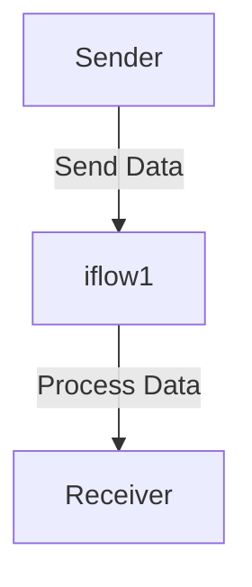

<h1 style="color: #1f4e79; text-align: center; font-size: 3.5em; margin-bottom: 10px;">iflow1</h1><h2 style="text-align: center; font-size: 1.8em; font-weight: normal; margin-top: 0;">Technical Specification Document</h2>

<table style="width: 60%; margin: 0 auto;"><tr><th>Author</th><td>Akila710</td></tr><tr><th>Date</th><td>2026-01-05</td></tr><tr><th>Version</th><td>1.0.0</td></tr></table>

<h1 style="color: #1f4e79; font-size: 2.5em;">Table of Contents</h1>
1. Introduction  
&nbsp;&nbsp;&nbsp; 1.1 Purpose  
&nbsp;&nbsp;&nbsp; 1.2 Scope  
2. Integration Overview  
&nbsp;&nbsp;&nbsp; 2.1 Integration Architecture  
&nbsp;&nbsp;&nbsp; 2.2 Integration Components  
3. Integration Scenarios  
&nbsp;&nbsp;&nbsp; 3.1 Scenario Description  
&nbsp;&nbsp;&nbsp; 3.2 Data Flows  
&nbsp;&nbsp;&nbsp; 3.3 Security Requirements  
4. Error Handling and Logging  
5. Testing Validation  
6. Reference Documents  

<h1 style="color: #1f4e79;">1. Introduction</h1>
<b style="color: #1f4e79;">1.1 Purpose:</b>  
The iFlow 'iflow1' addresses the need for seamless data exchange between a sender and a receiver system. The trigger mechanism for this iFlow is a message start event, which initiates the integration process upon receiving a message. The technical outcome is the successful transmission of data from the sender to the receiver, ensuring that the data is processed and logged appropriately. The artifacts involved include the BPMN definitions that outline the integration flow, including start and end events, and the sequence flow that connects them.

<b style="color: #1f4e79;">1.2 Scope:</b>  
The scope of 'iflow1' includes the following endpoints:
- **Sender**: The initiating system that sends data to the iFlow.
- **Receiver**: The target system that receives the processed data.

The data transformation logic is minimal in this flow, as it primarily serves as a conduit for data transfer without complex transformations. The target systems involved are the sender and receiver endpoints, which are defined within the BPMN process.

<h1 style="color: #1f4e79;">2. Integration Overview</h1>
<b style="color: #1f4e79;">2.1 Integration Architecture:</b>  

<b style="color: #1f4e79;">2.2 Integration Components:</b>  
| Component          | Role                      | Details                                                                 |
|--------------------|---------------------------|-------------------------------------------------------------------------|
| Start Event        | Initiates the process     | Triggers the iFlow when a message is received.                         |
| End Event          | Completes the process     | Marks the end of the integration flow.                                  |
| Sequence Flow      | Connects events           | Defines the flow from the start event to the end event.                |
| Sender Endpoint     | Data source               | Represents the system sending data to the iFlow.                       |
| Receiver Endpoint   | Data destination          | Represents the system receiving data from the iFlow.                    |

<h1 style="color: #1f4e79;">3. Integration Scenarios</h1>
<b style="color: #1f4e79;">3.1 Scenario Description:</b>  
1. The sender system sends a message to the iFlow.
2. The iFlow receives the message and triggers the start event.
3. The integration process is initiated, and the data is processed.
4. The iFlow completes the process and sends the data to the receiver system.
5. The end event is triggered, marking the completion of the integration flow.

<b style="color: #1f4e79;">3.2 Data Flows:</b>  
The data flow in 'iflow1' is straightforward, with data being sent from the sender to the receiver without any transformation. The flow is as follows:
- Data is sent from the sender to the iFlow.
- The iFlow processes the data (if necessary).
- Data is sent from the iFlow to the receiver.

<b style="color: #1f4e79;">3.3 Security Requirements:</b>  
- Basic authentication is not enabled for the sender endpoint.
- No sensitive data is being transmitted, thus reducing security concerns.
- Logging is enabled for all events to ensure traceability.

<h1 style="color: #1f4e79;">4. Error Handling and Logging</h1>  
Error handling is managed through the logging of all events. Any errors encountered during the integration process will be logged for further analysis. The iFlow is designed to return exceptions to the sender if configured to do so.

<h1 style="color: #1f4e79;">5. Testing Validation</h1>  
**Testing Details – Sheet: Testing**  
| Test Case ID | Scenario                     | Expected Outcome                          |
| :---         | :---                         | :---                                      |
| TC01         | Send data from sender        | Data is received by the iFlow successfully. |
| TC02         | Complete integration process  | Data is sent to the receiver without errors. |

<h1 style="color: #1f4e79;">6. Reference Documents</h1>  
- SAP CPI Documentation  
- BPMN 2.0 Specification  
- Integration Patterns in SAP CPI  
