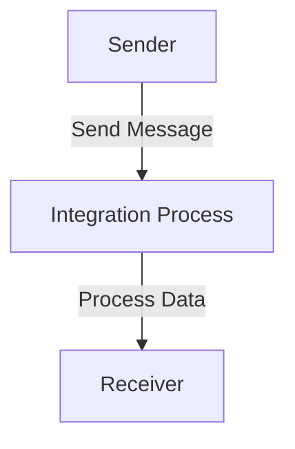

<h1 style="color: #1f4e79; text-align: center; font-size: 3.5em; margin-bottom: 10px;">iflow1</h1><h2 style="text-align: center; font-size: 1.8em; font-weight: normal; margin-top: 0;">Technical Specification Document</h2>

<table style="width: 60%; margin: 0 auto;"><tr><th>Author</th><td>Akila710</td></tr><tr><th>Date</th><td>2026-01-05</td></tr><tr><th>Version</th><td>1.0.0</td></tr></table>

<h1 style="color: #1f4e79; font-size: 2.5em;">Table of Contents</h1>
1. Introduction  
&nbsp;&nbsp;&nbsp; 1.1 Purpose  
&nbsp;&nbsp;&nbsp; 1.2 Scope  
2. Integration Overview  
&nbsp;&nbsp;&nbsp; 2.1 Integration Architecture  
&nbsp;&nbsp;&nbsp; 2.2 Integration Components  
3. Integration Scenarios  
&nbsp;&nbsp;&nbsp; 3.1 Scenario Description  
&nbsp;&nbsp;&nbsp; 3.2 Data Flows  
&nbsp;&nbsp;&nbsp; 3.3 Security Requirements  
4. Error Handling and Logging  
5. Testing Validation  
6. Reference Documents  

<h1 style="color: #1f4e79;">1. Introduction</h1>
<b style="color: #1f4e79;">1.1 Purpose:</b>  
The iFlow 'iflow1' addresses the need for seamless data exchange between a sender and a receiver system. The trigger mechanism for this iFlow is a message sent from the sender endpoint, which initiates the integration process. The technical outcome is the successful transmission of data from the sender to the receiver, ensuring that the data is processed correctly and efficiently. The artifacts involved include the BPMN process definition, which outlines the flow of data and the interactions between components.

<b style="color: #1f4e79;">1.2 Scope:</b>  
The scope of 'iflow1' includes the following endpoints:
- **Sender Endpoint:** Initiates the integration process.
- **Receiver Endpoint:** Receives the processed data.

The data transformation logic is minimal in this flow, primarily focusing on the direct transfer of messages without complex transformations. The target systems are defined as the sender and receiver, which are expected to communicate over a secure channel.

<h1 style="color: #1f4e79;">2. Integration Overview</h1>
<b style="color: #1f4e79;">2.1 Integration Architecture:</b>  

<b style="color: #1f4e79;">2.2 Integration Components:</b>  
| Component               | Role                          | Details                                                                 |
|------------------------|-------------------------------|-------------------------------------------------------------------------|
| EndpointSender         | Initiates the integration flow | Sends messages to the integration process.                              |
| EndpointReceiver       | Receives the processed data    | Accepts messages from the integration process.                          |
| Integration Process     | Manages the flow of data      | Contains the logic for processing the incoming message and sending it out.|

<h1 style="color: #1f4e79;">3. Integration Scenarios</h1>
<b style="color: #1f4e79;">3.1 Scenario Description:</b>  
1. The sender system sends a message to the iFlow.
2. The iFlow receives the message at the Start Event.
3. The message is processed within the Integration Process.
4. The processed message is sent to the receiver system.
5. The flow ends at the End Event.

<b style="color: #1f4e79;">3.2 Data Flows:</b>  
The data flow in 'iflow1' is straightforward, with a single message being sent from the sender to the receiver without any transformation.

<b style="color: #1f4e79;">3.3 Security Requirements:</b>  
- Ensure that the communication between the sender and receiver is secured.
- Implement authentication mechanisms if required by the endpoints.

<h1 style="color: #1f4e79;">4. Error Handling and Logging</h1>  
Error handling is managed through the logging of all events. Any exceptions that occur during the integration process will be logged for further analysis. The iFlow is configured to not return exceptions to the sender, ensuring that the sender does not receive error messages directly.

<h1 style="color: #1f4e79;">5. Testing Validation</h1>  
**Testing Details – Sheet: Testing**  
| Test Case ID | Scenario                     | Expected Outcome                          |
| :---         | :---                         | :---                                      |
| TC_001       | Send message from sender     | Message is received by the receiver.     |
| TC_002       | Process message in iFlow     | Message is processed without errors.     |
| TC_003       | End-to-end flow validation    | Successful completion of the integration. |

<h1 style="color: #1f4e79;">6. Reference Documents</h1>  
- SAP CPI Documentation  
- BPMN 2.0 Specification  
- Integration Patterns and Best Practices  
