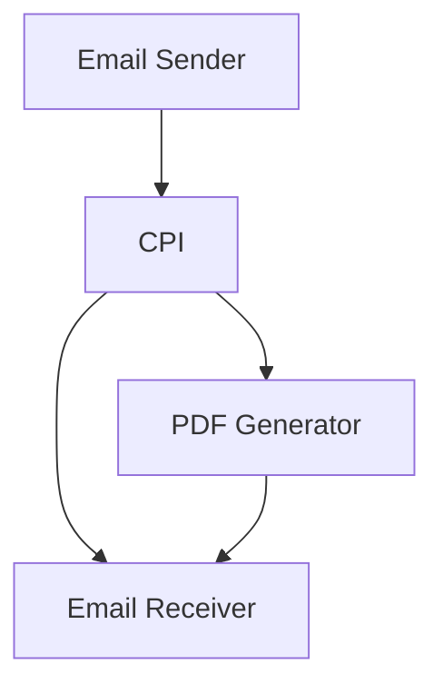

# Email Contents to PDF iFlow Documentation
## High-level Architecture
The Email Contents to PDF iFlow is designed to retrieve email contents from a sender system, convert the email body into a PDF document, and send the PDF document as an attachment to a receiver system.

## Purpose
The purpose of this iFlow is to demonstrate the conversion of email contents into a PDF document using SAP Cloud Platform Integration (CPI).

## Sender/Receiver Systems
* Sender System: Gmail (IMAP)
* Receiver System: Gmail (SMTP)

## Adapter Types Used
* Mail Adapter (IMAP) for sender system
* Mail Adapter (SMTP) for receiver system

## Step-by-Step Flow Explanation
1. The iFlow starts with a **Start Event** that triggers the flow.
2. The **Content Modifier 1** step is used to extract the email body from the incoming message.
3. The **Groovy Script 1** step is used to convert the email body into a PDF document using the iTextPDF library.
4. The **End Event** marks the end of the flow, and the PDF document is sent as an attachment to the receiver system.

## Mapping Logic Summary
The mapping logic is implemented in the Groovy script, which extracts the email body from the incoming message and converts it into a PDF document.

## Groovy Script Explanation
The Groovy script uses the iTextPDF library to create a PDF document from the email body. It defines a function `createPdf` that takes the email body as input and returns the PDF content as a byte array. The script then creates attachments with different names (same content) and sets the body text of the outgoing message.

## Error Handling
Error handling is not explicitly implemented in this iFlow. However, the CPI platform provides built-in error handling mechanisms, such as logging and exception handling, that can be used to handle errors that may occur during the execution of the iFlow.

## Security/Authentication
The iFlow uses basic authentication for the sender and receiver systems. The credentials are stored in the CPI platform and are used to authenticate the connections to the sender and receiver systems.

## High-Level Mermaid Diagram

Note: This diagram provides a high-level overview of the iFlow and is not a detailed representation of the flow.
