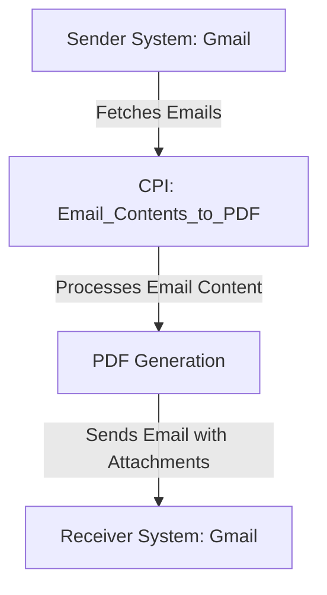

# Email_Contents_to_PDF iFlow Documentation

## 1. High-level architecture
The Email_Contents_to_PDF iFlow integrates email content retrieval and PDF generation. It utilizes SAP Cloud Platform Integration (CPI) to fetch emails from a Gmail account, convert the email body into a PDF format, and send the generated PDFs as email attachments to a specified recipient.

## 2. Purpose of this iFlow
The primary purpose of this iFlow is to automate the process of converting email content into PDF format and sending it as an attachment. This is particularly useful for archiving or sharing email content in a standardized format.

## 3. Sender/Receiver systems
- **Sender System**: Gmail (IMAP protocol)
- **Receiver System**: Gmail (SMTP protocol)

## 4. Adapter types used
- **Sender Adapter**: IMAP adapter to retrieve emails from the Gmail inbox.
- **Receiver Adapter**: SMTP adapter to send emails with PDF attachments.

## 5. Step-by-step flow explanation
1. **Start Event**: The iFlow is triggered based on a scheduled event to check for new unread emails in the Gmail inbox.
2. **Content Modifier**: The email body is extracted and prepared for processing.
3. **Groovy Script**: The email body is passed to a Groovy script that converts the content into a PDF format and creates two PDF attachments.
4. **End Event**: The iFlow concludes after sending the email with the PDF attachments to the specified recipient.

## 6. Mapping logic summary
The iFlow does not utilize XSLT for transformation. The mapping is primarily handled within the Groovy script, which processes the email body and generates PDF files.

## 7. Groovy script explanations
The Groovy script (`script1.groovy`) performs the following functions:
- Reads the email body from the incoming message.
- Defines a function to convert the email body text into a PDF document using the iText library.
- Generates two PDF attachments with the same content.
- Sets the email body to indicate that the original content is attached in PDF format.
- Attaches the generated PDFs to the outgoing message.

## 8. Error handling
Error handling is not explicitly defined in the provided artifacts. However, it is advisable to implement try-catch blocks within the Groovy script to manage exceptions that may arise during PDF generation or email sending.

## 9. Security/authentication
- **IMAP Authentication**: The iFlow uses basic authentication to connect to the Gmail account for retrieving emails. The username and password are specified in the iFlow configuration.
- **SMTP Authentication**: Similar to IMAP, SMTP also uses basic authentication for sending emails. The credentials are configured within the SMTP adapter settings.

## 10. High-Level Process Flow Diagram

