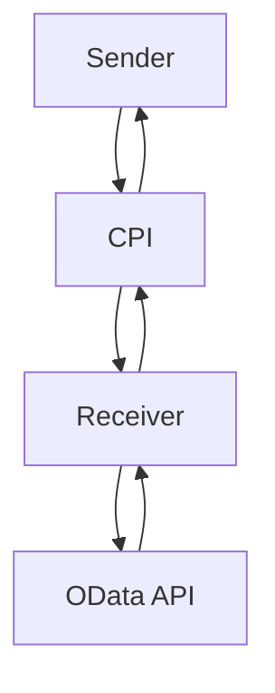

# Odata_Mass_PDF_upload iFlow Documentation
## High-level architecture
The Odata_Mass_PDF_upload iFlow is designed to handle mass PDF uploads from a sender system to a receiver system via SAP Cloud Platform Integration (CPI). The iFlow consists of a sender, a receiver, and an integration process.

## Purpose
The purpose of this iFlow is to facilitate the mass upload of PDF files from a sender system to a receiver system, utilizing SAP CPI as the integration platform.

## Sender/Receiver systems
* **Sender System:** The sender system is the source of the PDF files to be uploaded. The sender system is configured as an Endpoint Sender in the iFlow.
* **Receiver System:** The receiver system is the target system where the PDF files will be uploaded. The receiver system is configured as an Endpoint Receiver in the iFlow.

## Adapter types used
The iFlow uses the following adapter types:
* **HTTP Adapter:** The HTTP adapter is used to send and receive messages between the sender and receiver systems.
* **OData Adapter:** The OData adapter is used to interact with the receiver system's OData API.

## Step-by-step flow explanation
1. The sender system sends a request to the iFlow to initiate the mass PDF upload process.
2. The iFlow receives the request and triggers the integration process.
3. The integration process retrieves the PDF files from the sender system using the HTTP adapter.
4. The integration process then uses the OData adapter to upload the PDF files to the receiver system.
5. The receiver system processes the uploaded PDF files and sends a response back to the iFlow.
6. The iFlow receives the response and sends a confirmation back to the sender system.

## Mapping logic summary
The mapping logic is used to transform the PDF files from the sender system's format to the receiver system's format. The mapping logic is implemented using SAP CPI's built-in mapping tools.

## Groovy script explanation
No Groovy script is used in this iFlow.

## Error handling
Error handling is implemented using SAP CPI's built-in error handling mechanisms. If an error occurs during the execution of the iFlow, the error is logged and a notification is sent to the administrator.

## Security/authentication
Security and authentication are implemented using SAP CPI's built-in security features, including SSL/TLS encryption and basic authentication.

## High-Level Mermaid Diagram

