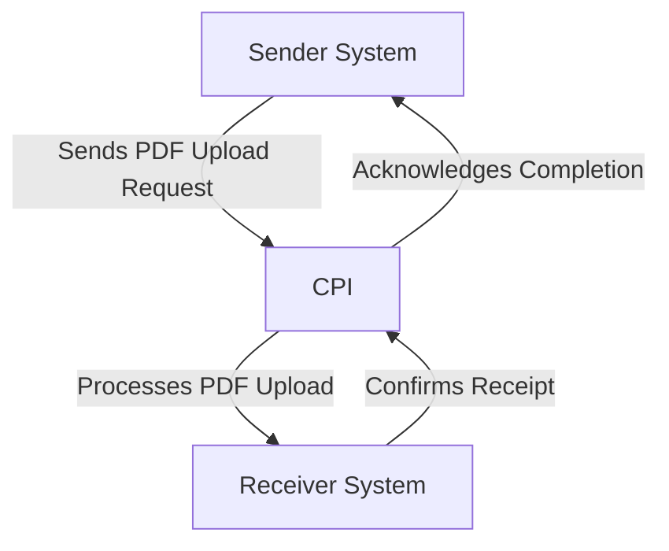

# Odata_Mass_PDF_upload iFlow Documentation

## 1. High-level architecture
The Odata_Mass_PDF_upload iFlow is designed to facilitate the integration between a sender system and a receiver system, enabling the mass upload of PDF documents via OData services. The architecture consists of a sender endpoint that initiates the process, an integration process that handles the logic, and a receiver endpoint that completes the transaction.

## 2. Purpose of this iFlow
The primary purpose of the Odata_Mass_PDF_upload iFlow is to enable the mass upload of PDF files from a sender system to a receiver system using OData protocols. This integration allows for efficient handling of document uploads, ensuring that multiple files can be processed in a single transaction.

## 3. Sender/Receiver systems
- **Sender System**: The system that initiates the upload of PDF documents. It sends requests to the iFlow.
- **Receiver System**: The system that receives the uploaded PDF documents and processes them accordingly.

## 4. Adapter types used
The iFlow utilizes the following adapter types:
- **HTTP Adapter**: Used for communication between the sender and the iFlow.
- **OData Adapter**: Facilitates the interaction with OData services for document uploads.

## 5. Step-by-step flow explanation
1. **Start Event**: The iFlow begins with a start event that triggers the integration process upon receiving a request from the sender system.
2. **Integration Process**: The core logic of the iFlow is executed, which includes handling the incoming PDF documents.
3. **End Event**: The process concludes with an end event, signaling the completion of the document upload.

## 6. Mapping logic summary
The iFlow does not explicitly define any XSLT or mapping logic in the provided artifacts. The integration primarily focuses on the transfer of PDF documents without additional transformation requirements.

## 7. Groovy script explanations
No Groovy scripts are provided in the artifacts for the Odata_Mass_PDF_upload iFlow. The integration logic appears to be straightforward, relying on the built-in capabilities of the iFlow without custom scripting.

## 8. Error handling
The iFlow configuration indicates that the error handling strategy is not explicitly defined. However, it is essential to implement error handling mechanisms to manage potential issues during the document upload process, such as network failures or invalid document formats.

## 9. Security/authentication
The iFlow configuration specifies that basic authentication is not enabled for the sender endpoint. This means that the integration does not require credentials for access. However, it is advisable to implement security measures, such as:
- **Transport Layer Security (TLS)**: To encrypt data in transit.
- **Access Control**: To restrict access to authorized users only.

## 10. High-Level Process Flow Diagram

