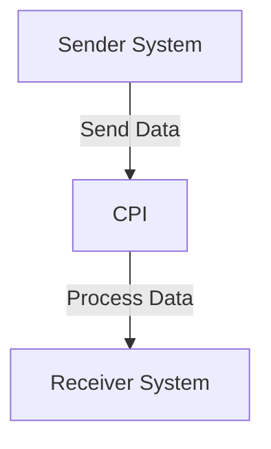

# 1. High-level architecture

The architecture of the iFlow 'Practice' consists of a sender system that initiates the integration process, a central SAP Cloud Platform Integration (CPI) environment that processes the data, and a receiver system that receives the processed output. The integration flow is designed to facilitate seamless communication between these systems.

# 2. Purpose of this iFlow

The purpose of the 'Practice' iFlow is to manage the integration between a sender and a receiver system, ensuring that data is transmitted efficiently and accurately. This iFlow serves as a basic template for integration scenarios, demonstrating the fundamental components and processes involved in SAP CPI.

# 3. Sender/Receiver systems

- **Sender System**: This is the initiating system that sends data to the CPI. It is configured as an EndpointSender in the iFlow.
- **Receiver System**: This is the destination system that receives the processed data from the CPI. It is configured as an EndpointReceiver in the iFlow.

# 4. Adapter types used

The iFlow utilizes the following adapter types:
- **Sender Adapter**: Configured as an EndpointSender, which handles incoming messages from the sender system.
- **Receiver Adapter**: Configured as an EndpointReceiver, which manages outgoing messages to the receiver system.

# 5. Step-by-step flow explanation

1. **Start Event**: The integration process begins with a Start Event, which triggers the flow when a message is received from the sender system.
2. **Processing**: The message is processed within the CPI environment. This may involve transformations, routing, or other processing logic (not detailed in the provided artifacts).
3. **End Event**: The flow concludes with an End Event, indicating that the message has been successfully processed and sent to the receiver system.

# 6. Mapping logic summary

The provided artifacts do not include specific XSLT or mapping logic. However, it is implied that any necessary transformations would occur within the processing step of the iFlow, potentially utilizing built-in mapping capabilities of SAP CPI.

# 7. Groovy script explanations

No Groovy scripts are provided in the artifacts for the 'Practice' iFlow. If any scripts were to be included, they would typically be used for custom processing logic, data manipulation, or additional transformations that cannot be achieved through standard mapping.

# 8. Error handling

The iFlow configuration indicates that the error handling strategy is not explicitly defined. However, it is essential to implement error handling mechanisms to manage exceptions that may occur during the integration process. This could involve logging errors, sending notifications, or implementing retry logic.

# 9. Security/authentication

The iFlow configuration specifies that basic authentication is not enabled for the sender system. This means that the integration does not require credentials for the sender to communicate with the CPI. Security measures should be considered for production environments, including:
- Enabling HTTPS for secure data transmission.
- Implementing OAuth or other authentication mechanisms as needed.

# 10. High-Level Process Flow Diagram

