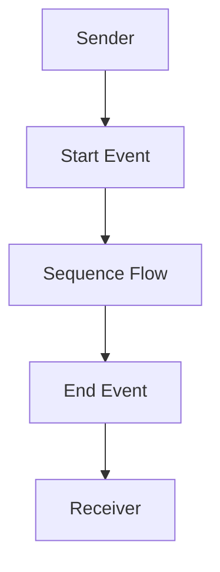

# CPI iFlow 'Practice' Documentation
## High-level Architecture
The CPI iFlow 'Practice' is designed as a simple integration flow with a sender and receiver system. The flow starts with a start event, followed by a sequence flow that leads to an end event.

## Purpose
The purpose of this iFlow is to demonstrate a basic integration flow in SAP Cloud Platform Integration (CPI).

## Sender/Receiver Systems
* **Sender System:** The sender system is represented by the participant 'Sender' in the iFlow.
* **Receiver System:** The receiver system is represented by the participant 'Receiver' in the iFlow.

## Adapter Types Used
The adapter types used in this iFlow are not explicitly specified in the provided XML file. However, based on the participant types, it can be inferred that the sender and receiver systems are using HTTP adapters.

## Step-by-Step Flow Explanation
1. The iFlow starts with a **Start Event**.
2. The start event triggers a **Sequence Flow** that leads to the **End Event**.
3. The end event marks the end of the iFlow.

## Mapping Logic Summary (XML/JSON/XSLT)
There is no mapping logic specified in the provided XML file.

## Groovy Script Logic Explanation
There is no Groovy script logic specified in the provided XML file.

## Error Handling
Error handling is not explicitly specified in the provided XML file. However, the iFlow has a property `returnExceptionToSender` set to `false`, which means that exceptions will not be returned to the sender system.

## Security/Authentication
Security and authentication are not explicitly specified in the provided XML file. However, the sender system has a property `enableBasicAuthentication` set to `false`, which means that basic authentication is not enabled.

## High-Level Mermaid Diagram

Note: This diagram represents the high-level flow of the iFlow, with the sender system triggering the start event, followed by a sequence flow that leads to the end event, and finally the receiver system receiving the output.
