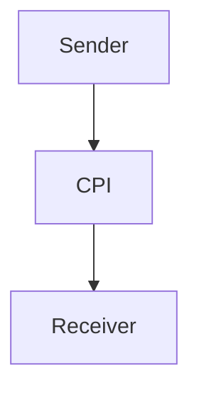

# CPI iFlow 'Practice' Documentation
## High-level Architecture
The CPI iFlow 'Practice' is designed to integrate with sender and receiver systems, facilitating the exchange of data between them. The iFlow utilizes SAP Cloud Platform Integration (CPI) to enable seamless communication between the systems.

## Purpose
The primary purpose of the 'Practice' iFlow is to demonstrate a basic integration scenario, showcasing the capabilities of SAP CPI in facilitating data exchange between different systems.

## Sender/Receiver Systems
The sender system is represented by the 'Sender' participant, while the receiver system is represented by the 'Receiver' participant. The integration process is facilitated by the 'Integration Process' participant.

## Adapter Types Used
The iFlow utilizes the following adapter types:
- Endpoint Sender (for sending data to the receiver system)
- Endpoint Receiver (for receiving data from the sender system)

## Step-by-Step Flow Explanation
1. The iFlow starts with a 'Start' event, which triggers the integration process.
2. The integration process then proceeds to the 'End' event, which marks the completion of the iFlow.

## Mapping Logic Summary (XML/JSON/XSLT)
No explicit mapping logic is defined in the provided iFlow configuration.

## Groovy Script Logic Explanation
No Groovy scripts are used in the provided iFlow configuration.

## Error Handling
Error handling is not explicitly defined in the provided iFlow configuration. However, SAP CPI provides built-in error handling mechanisms that can be leveraged to handle errors and exceptions.

## Security/Authentication
Security and authentication mechanisms are not explicitly defined in the provided iFlow configuration. However, SAP CPI provides various security features, such as basic authentication and SSL/TLS encryption, to ensure secure data exchange.

## High-Level Mermaid Diagram

This diagram illustrates the high-level architecture of the 'Practice' iFlow, showcasing the sender and receiver systems, as well as the CPI integration process.
